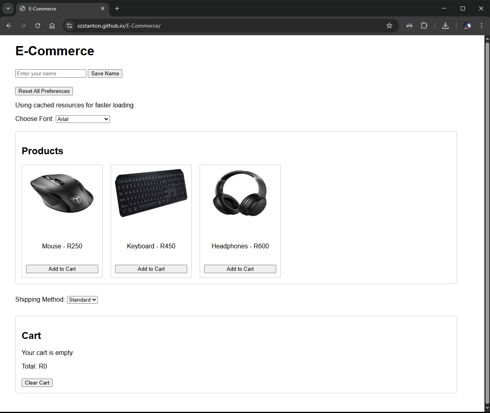

# E-Commerce (Web Storage Demo)

A small storefront demo focused on browser data persistence — saving user preferences and cart state without a backend. This project demonstrates working with cache, cookies, session storage, and local storage in vanilla JavaScript.

## Live Demo

https://szstanton.github.io/E-Commerce/

## Screenshots



## Features

- Save and persist a username across sessions using local storage
- Add products to cart with a live running total
- Font preference selector, saved via local storage
- Reset all saved preferences with one action
- Uses cached resources for faster loading

## Tech Stack

HTML5, CSS3, JavaScript (Web Storage APIs)

## Installation

1. Clone the repository

   ```bash
   git clone https://github.com/SZStanton/E-Commerce
   ```

2. Open `index.html` in your browser — no build step or dependencies required
